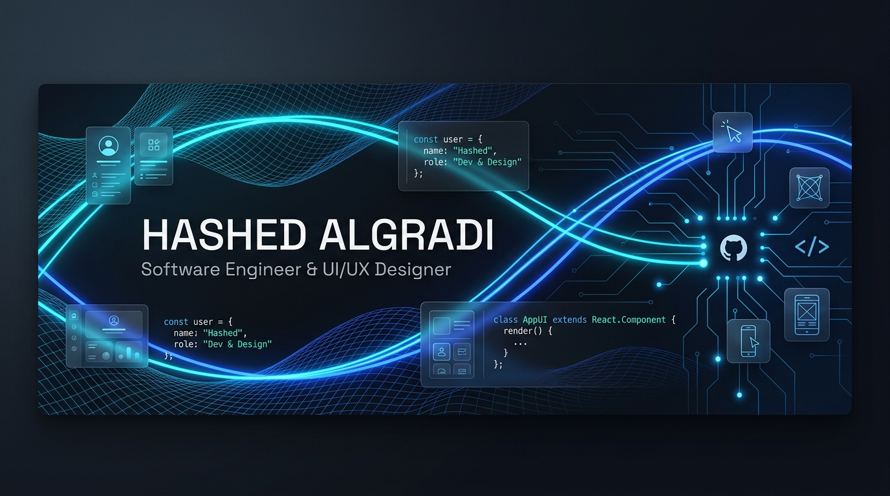

  <!-- Header Banner (You can upload banner.jpg to your repository or use the dynamic SVG below) -->
  

  <!-- Animated Typing Tagline -->
  

  

    <b>أجمع بين هندسة البرمجيات وسيكولوجية تصميم واجهات المستخدم (UI/UX) لبناء تطبيقات متينة وذكية.</b>
  

  <!-- Social & Quick Badges -->
  

    
    
    
    
  

---

### 🚀 About Me | نبذة عنّي

- 💼 **Role:** Software Engineer & UI/UX Designer
- 📍 **Location:** Sana'a, Yemen
- 🌐 **Official Website:** [hashedalgradi.tech](https://hashedalgradi.tech)
- 🎯 **Focus Areas:** Cross-Platform Mobile Apps (Flutter), Enterprise Backends (Laravel), and Human-Centered UI/UX.
- 💡 **Philosophy:** Bridging the gap between robust software architecture and intuitive design psychology (Fitts's Law, Native RTL Layouts).
- 📄 **Resume / CV:** [Download CV](https://hashedalgradi.tech/storage/settings/AbYqzPduOqtyCQ3aqfhIF2pNbwMPogVoDjR6MPZu.pdf)

---

### 🛠️ Tech Stack & Skills | التقنيات والمهارات

<table>
  <tr>
    <td align="center" width="90"><b>Mobile</b></td>
    <td>
      
      
      
      
      
      
    </td>
  </tr>
  <tr>
    <td align="center" width="90"><b>Backend</b></td>
    <td>
      
      
      
      
      
      
    </td>
  </tr>
  <tr>
    <td align="center" width="90"><b>UI / UX</b></td>
    <td>
      
      
      
      
      
      
      
    </td>
  </tr>
  <tr>
    <td align="center" width="90"><b>Tools & QA</b></td>
    <td>
      
      
      
      
    </td>
  </tr>
</table>

---

### 🌟 Featured Projects | أبرز الأعمال والمشاريع

<table>
  <!-- Flagship Enterprise LMS Project -->
  <tr>
    <td colspan="2" valign="top">
      <h3 align="center">🎓 مسار جامعتي — منصة التعليم الجامعي المتكاملة (Masar Jamiati LMS)</h3>
      

        <b>منظومة إلكترونية رائدة لإدارة التعليم الجامعي (طُبّقت فعلياً في جامعة الرشيد الذكية)</b>
         
        <i>Enterprise Web App & Mobile Ecosystem — Full-Stack & UI/UX Architecture</i>
      

      <ul>
        <li><b>🏛️ هندسة ومعمارية الباكيند (Laravel 12 Clean Architecture):</b>
          <ul>
            <li>بناء وتطبيق معمارية برمجية متقدمة تفصل بين طبقات المنطق (Domain Layer) والبيانات بأمان تام.</li>
            <li>نظام <b>الرفع المجزأ (Chunk Upload)</b> لمعالجة ورفع المحاضرات والمرفقات الضخمة بسلاسة دون استنزاف موارد السيرفر.</li>
            <li>معالجة العمليات والملفات الثقيلة وضغطها عبر <b>طوابير المعالجة الخلفية (Laravel Queues & Background Jobs)</b>.</li>
            <li>نظام صلاحيات وأدوار أكاديمية صارم <b>RBAC يغطي 8 أدوار مختلفة</b> (رئاسة الجامعة، العمداء، المدرسين، الطلاب، وغيرهم).</li>
            <li>معالجة البيانات الضخمة وفحص ملفات الطلاب عبر <b>Spatie Simple Excel</b> مع واجهة تدقيق تفاعلية للمستخدم باللغة العربية.</li>
            <li>إدارة الكاش متعدد الطبقات <b>(PageCache & BlogCache)</b> مع تكامل PWA و Service Workers لتجربة صامدة حتى عند تذبذب الإنترنت.</li>
          </ul>
        </li>
        <li><b>🎨 سيكولوجية التصميم وتجربة المستخدم (Design Psychology & Inclusive UX):</b>
          <ul>
            <li>مكافحة الإرهاق المعرفي (Cognitive Overload) للطلاب في تسجيل المواد عبر مسار خطوات تتابعي وتدقيق لحظي للمتطلبات السابقة.</li>
            <li>عزل الكثافة البصرية للمدرسين عبر واجهة خاصة (TeacherShellScreen) ونوافذ منبثقة تفاعلية بمؤشرات إنجاز واضحة.</li>
            <li>تفاعل بصري بهيج (Micro-interactions & Lottie) عند تسليم الواجبات وإعلان النتائج، مع Skeleton Shimmer أثناء التحميل.</li>
          </ul>
        </li>
        <li><b>📱 تطبيق الجوال (Cross-Platform Flutter):</b> تطبيق متكامل مبني بـ <b>Flutter & Riverpod</b> ومتصل بـ RESTful APIs آمنة وإشعارات فورية عبر <b>Firebase FCM (DevicePushService)</b>.</li>
      </ul>
      

        
        &nbsp;
        
      

    </td>
  </tr>
  <!-- Daftr App & Souqak App -->
  <tr>
    <td width="50%" valign="top">
      <h3 align="center">📱 تطبيق دفتر — Daftr App</h3>
      

        <b>تطبيق مالي شخصي لإدارة الديون والحسابات (Offline-First)</b>
      

      <ul>
        <li>بديل رقمي متطور للدفاتر الورقية التقليدية بدون الحاجة لاتصال دائم بالإنترنت.</li>
        <li>تسجيل المعاملات وتوثيقها بالمرفقات، مع حاسبة مدمجة وصانع حالات ورسائل سداد احترافية وودية.</li>
        <li><b>التقنيات:</b> Flutter, Dart, Local Storage, Design Psychology (Fitts's Law UX).</li>
      </ul>
      

        <a href="https://hashedalgradi.tech/projects/a25e0327-a49c-4dd7-b8d5-d32d883a37fa">🔗 دراسة الحالة وتفاصيل المشروع</a>
      

    </td>
    <td width="50%" valign="top">
      <h3 align="center">🛍️ تطبيق سوقك — Souqak E-commerce</h3>
      

        <b>منصة وتطبيق متكامل للتجارة الإلكترونية العصرية</b>
      

      <ul>
        <li>تصميم UX/UI عصري وتدفق مرن وسلس للمستخدم بين تصنيفات المنتجات وسلة الشراء.</li>
        <li>ربط متين بين واجهة تطبيق الهاتف واللوحة الخلفية لمعالجة العمليات وتحديث البيانات لحظياً.</li>
        <li><b>التقنيات:</b> Flutter, Laravel, Vue.js, Tailwind CSS, REST APIs.</li>
      </ul>
      

        <a href="https://hashedalgradi.tech/projects/a1f5e6d4-92e2-41d1-b0ac-94410e5f88fa">🔗 دراسة الحالة وتفاصيل المشروع</a>
      

    </td>
  </tr>
</table>

---

### 📊 GitHub Activity & Stats | إحصائيات ونشاط الحساب

  
  

  

---

### 📬 Connect With Me | وسائل التواصل والعمل الحر

  هل لديك فكرة أو مشروع برمجـي؟ يسعدني التعاون معك!
    
  
  &nbsp;
  
  &nbsp;
  

  

